# pridav-music-project

Modeling &amp; analysis of music popularity across different genres and artists - project for 1-DAV-302/20 - priDAV

## 1. Research Questions and Project Goals

### Main Research Questions

1. Is the data representative on a global scale and release year basis?
2. Which musical attributes have the greatest impact on track popularity?
3. To what extent do acoustic vs artist attributes influence overall track popularity?

### Project Objectives

- Analyze relationships between various music track attributes and their popularity
- Develop a model to predict music track popularity
- Identify key factors contributing to model performance

## 2. Tools and Technologies

### Programming Languages and Libraries

#### Languages

- Python

#### Libraries

1. Scrapers:
- requests, pandas, time, typing, os, dotenv, tqdm
2. Data Processing and Analysis:
- numpy, pandas, matplotlib, seaborn, warnings, ...
3. Machine Learning:
- sklearn, xgboost, os, sys, numpy, pandas, dotenv, ...

### Development Tools

- GitHub
- Jupyter Notebook
- Visual Studio Code or other IDE

## 3. Data Sources and Processing

### Data Sources

#### 1. Kaggle Spotify Dataset

- Data collected from a Kaggle dataset
    - Couldn't be collected through a scraper due to Spotify removing access for new developer accounts for some Data Points of it's Web API, including the Audio Features, as of late November 2024 ([link to relevant article](https://www.digitalmusicnews.com/2024/12/01/spotify-tightens-api-access-removes-several-data-points/))
- Link to dataset: [Spotify Tracks Dataset](https://www.kaggle.com/datasets/gauthamvijayaraj/spotify-tracks-dataset-updated-every-week/data)
- Author: [Gautham Vijayaraj](https://www.kaggle.com/gauthamvijayaraj)
- Last updated: December 9th 2024
- Contains track information and audio features
- Includes:
  - Track Identifiers:
    - `track_id` - Unique Spotify track identifier
    - `track_url` - URL to the track on Spotify
  - Basic Metadata:
    - `track_name` - Name of the track
    - `artist_name` - Name(s) of the artist(s)
    - `album_name` - Name of the album
    - `year` - Release year
    - `artwork_url` - URL to album artwork
    - `language` - Track language
  - Target Variable:
    - `popularity` - Track popularity score
  - Audio Features:
    - `acousticness` - Confidence measure of acoustic sound
    - `danceability` - How suitable for dancing
    - `energy` - Perceptual measure of intensity
    - `instrumentalness` - Prediction of no vocal content
    - `liveness` - Presence of audience in the recording
    - `loudness` - Overall loudness in decibels
    - `speechiness` - Presence of spoken words
    - `valence` - Musical positiveness measure
  - Musical Attributes:
    - `duration_ms` - Track length in milliseconds
    - `key` - Key of the track
    - `mode` - Modality (major or minor)
    - `tempo` - Estimated tempo in BPM
    - `time_signature` - Estimated time signature

#### 2. Spotify API

- Data collected through Spotify Web API
- Contains additional track and artist information for Kaggle dataset records
- Last scraped: December 28th 2024
- Includes:
  - Track Reference:
    - `track_id` - Matching ID from Kaggle dataset
    - `track_name` - Track name for verification
  - Artist Information:
    - `artist_count` - Number of artists on the track
    - `artist_ids` - Spotify IDs for all artists
    - `artist_names` - Names of all artists
  - Artist Metrics:
    - `artist_popularities` - Popularity scores for all artists
    - `artist_followers` - Follower counts for all artists
    - `artist_genres` - Genre tags for all artists
  - Additional Metric:
    - `avg_artist_popularity` - Average popularity score for all artists
        - was calculated by averaging the `artist_popularities` column during the scraping process
        - was removed from modeling due to direct implementation in the pipeline

### Data Collection Process

#### 1. spotify_scraper.py:

- <strong>Not used because of deprecated endpoints</strong>
- Endpoint used:
    - `https://api.spotify.com/v1/playlists/{playlist_id}/tracks`
        - [link to documentation](https://developer.spotify.com/documentation/web-api/reference/get-playlists-tracks)
- Deprecated endpoints:
    - `https://api.spotify.com/v1/browse/categories/{category}/playlists`
        - [link to documentation](https://developer.spotify.com/documentation/web-api/reference/get-a-categories-playlists)
    - `https://api.spotify.com/v1/audio-features/{track_id}`
        - [link to documentation](https://developer.spotify.com/documentation/web-api/reference/get-audio-features)
- Technical implementation:
    - Built with requests library for API calls
    - Uses basic error handling and retries
    - Simple rate limiting with time.sleep()
    - Synchronous processing of requests
    - Basic JSON response parsing
- Process:
    - Would have used category playlist endpoint to get playlist IDs,
    instead playlists were manually added
    - Uses playlist endpoint to gather basic track info in batches
    - Would have used audio features endpoint to get audio features data, instead this approach, and scraper,  was abandoned
    - Handles rate limiting with automatic retries
    - Outputs scraped data into a csv file
- Would have been used to create our own dataset similar to the Kaggle one

#### 2. Kaggle Dataset:

- Contains over 60,000 records of track data
- Provides audio features that are no longer accessible via API for new developer accounts
- Used as our primary data source due to API limitations

#### 3. artist_details_scraper.py:

- Enriches track data with additional artist information
- Endpoints used:
    - `https://api.spotify.com/v1/tracks/{list_of_track_ids}`
        - [link to documentation](https://developer.spotify.com/documentation/web-api/reference/get-several-tracks)
    - `https://api.spotify.com/v1/artists/{list_of_artist_ids}`
        - [link to documentation](https://developer.spotify.com/documentation/web-api/reference/get-multiple-artists)
- Technical improvements from the first scraper:
    - Added tqdm for progress tracking
    - Improved error handling with specific exception types
    - Separated output creation into a separate function for better code readability
- Process:
    - Reads track IDs from the Kaggle dataset
    - Fetches basic track details in batches
    - Extracts unique artist IDs from track responses
    - Fetches artist information in batches
    - Combines track and artist data
    - Handles rate limiting with automatic retries
    - Outputs enriched data into a csv file

### Data Cleaning

#### Data Quality Issues

Multiple steps were subject of the data quality control such as:
- Null controls
- Data anomalies/corrupted fields

Missing data in the source datasets was represented using value -1, we developed an ETL mechanism to automate conversion to np.NaN.

#### Preprocessing Steps

We have applied general recommended data preprocessing transformations as well as custom-defined transformations regarding some attributes.

General transformations:
- Scaling numerical data
- Encoding categorical data based on One-Hot encoding principle

Custom transformations:
- custom-defined encoding of categorical data
- custom-defined aggregation strategies

The following columns required custom preprocessing transformation to correctly represent information, standard categorical encoding would cause massive column addition to the dataset.

- Artist_name: encoded as frequency of the artist in the dataset
- Mode: encoded based on "Circle of Fifths" musical theory
- Artist_followers: list-like value, column independent, aggregation on row basis
- Artist_popularities: list-like value, column independent, aggregation on row basis
- Album_name: frequency occurance encoding

All of the numerical data (encoded data as well) has been standardized in nested pipelines.

Automated Pipeline Architecture:

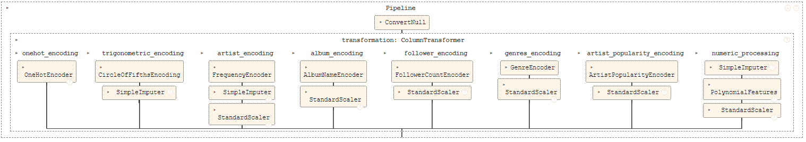

### Data Storage

The data files are stored locally in the `Development/{student_handle}/Data` directory for each developer.

## 4. Analysis and Results

### Exploratory Data Analysis

**Null analysis**

- NaNs represented by -1.0
- Only present in audio features

**Distribution analysis**

- Distributions implied outlier values
<!-- plot numeric distributions -->
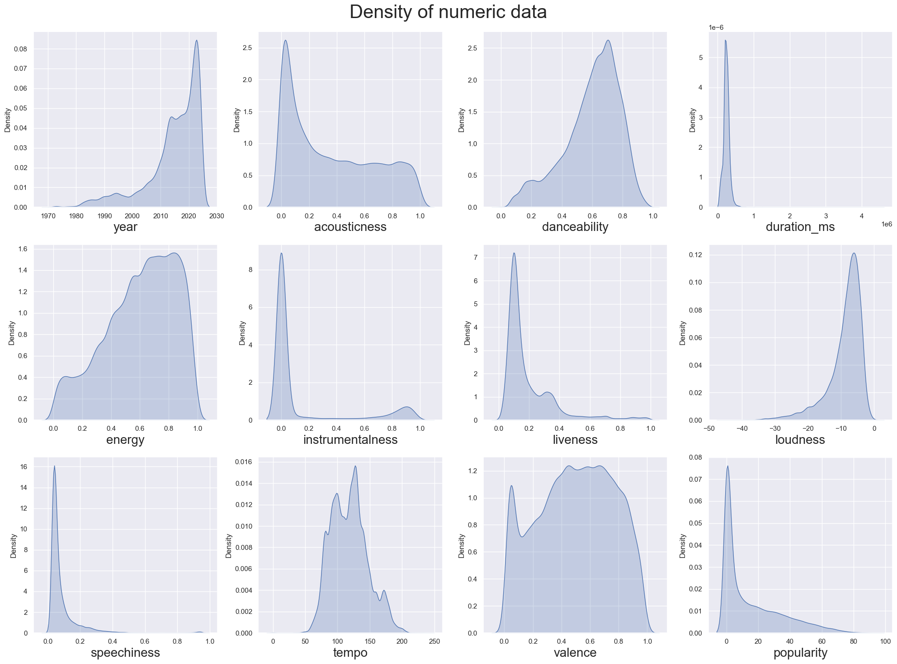
- Possible bias of decreasing popularity with years due to smaller count of older tracks in the dataset
<!-- mean popularity by year with count plot -->
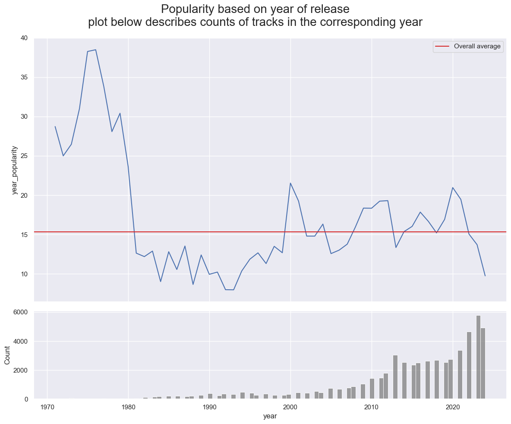

**Outlier analysis**

- We found there is a large amount of outliers in multiple columns such as *year, duration_ms, instrumentalness, liveness, loudness, speechiness and popularity*. 
- Notable - the mean popularity score is very close to 0, implying that only a fraction of songs become popular. This also proves that we shouldn't eliminate outliers.
<!-- boxplots grid -->

- The largest amount of outliers were present in the instrumentalness attribute, where it seems most values are either very close to 0 or very close to 1.

**Categorical attributes**

- The highest mean popularity is among tracks of Korean language.
<!-- plot popularity by language -->
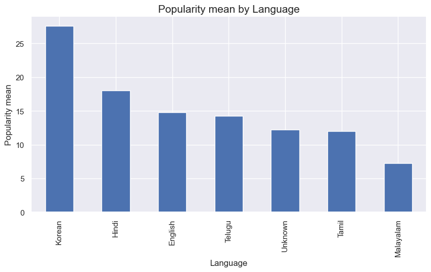
- Most prevalent Keys (Key signatures/ Scales) in the dataset were C, G, and D Major.
<!-- Keymode counts -->
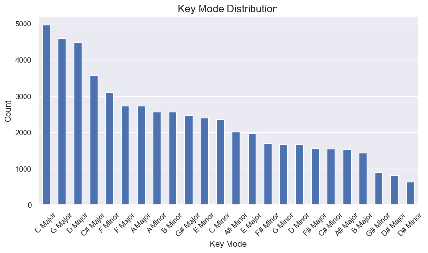
- Popularity is evenly distributed throughout keys and modes.
<!-- keymode popularity mean plot-->
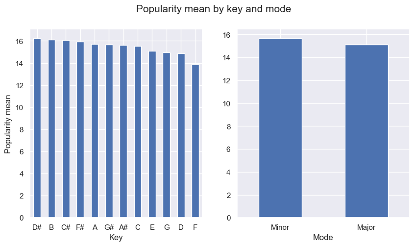
- Most prevalent time signature is 4/4 (common time) and other time signatures have negligible counts in comparison, which could imply this column would have little to no effect on predicting popularity.

**Correlation analysis**

We computed both spearman and pearson correlation matrices to look for values with highest correlations to popularity: 
<!-- Corr matrix plot -->
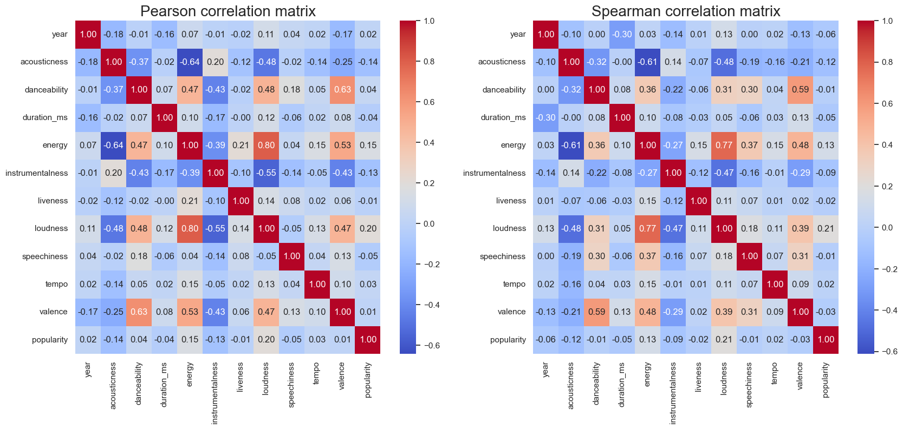
Columns with highest correlations to popularity:

positive:
- loudness (0.20)
- energy (0.15)

negative:
- acousticness (-0.14)
- instrumentalness (-0.13)
- speechiness (-0.05)

These could be the parameters with highest impact on popularity of a track.

**Normality testing**

- Shapiro-Wilk normality tests confirmed that no attributes in the dataset were normally distributed.

### Modeling

#### Linear models

**1. Linear Regression**

**2. Ridge Regression**

**3. Lasso Regression**

The basic toolkit of linear models was used in the project - linear regression as a foundation and its penalized versions to control the parameter weights. Generally
linear models did not perform well, this indicates that the relationships and patterns in data could not be explained linearly. As a countermeasure we have decided to utilize
ensemble methods. The results of linear models can be found below:

**Linear models summary:**

Unfortunately we have not achieved even test R^2 = 0.5, however this could be expected from analyses before as none of the data was normally distributed, large presence of outliers...

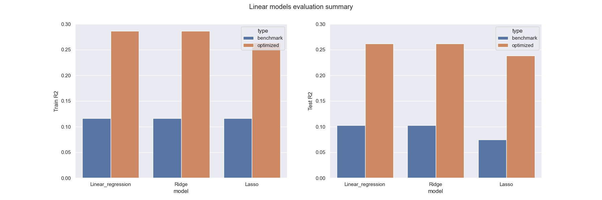

**Ridge attribute importance**

The optimized Ridge regression model proved to be the best out of the linear models overall, both optimized and benchmark included. Below you can find the weight allocation and importance of
parameters:

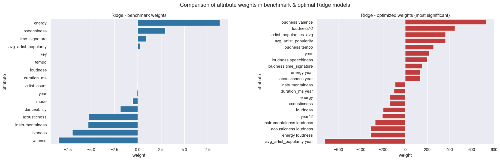

In contrast to results which can be found below regarding the optimized XGBoost, here the acoustic attributes proved to be the higher movers. This however is not sufficient enough to perform any
meaningful conclusions as the fit quality did not surpass R^2 > 0.5.

#### Ensemble models

**1. XGBoost**

- Gradient boosting model optimized for performance
- Best Hyperparameters found:
  - can be found in exported model, or in `model_hyperparameters.txt`
- Model Performance:
  - Train R^2 = 0.7 -> 0.71
  - Test R^2 = 0.55 -> 0.58

**XGBoost Regressor** proved to be a much better choice in modeling popularity than linear models, this algorithm combines multiple gradient boosting algorithms to create a complex system
which centralizes the output. With optimization we have managed to climb up to the Test R^2 = 0.58. The optimization has been performed using Randomized search with 100 iterations and 5-fold
cross-validation. Based on research listed below you can find the top 5% parameters (CI = 95%) with just 60 iterations of random search.

Random-search optimization research:
- https://web.archive.org/web/20160701182750/http://blog.dato.com/how-to-evaluate-machine-learning-models-part-4-hyperparameter-tuning

**Comparison of XGBoost Regressor & Linear models**:

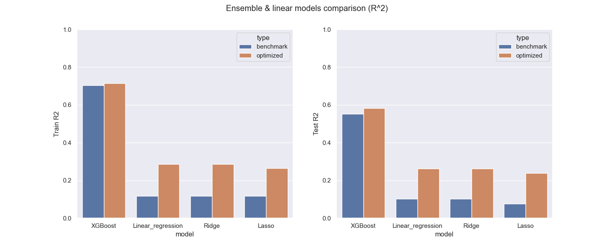

**2. Random Forest**

- Ensemble of decision trees with bagging
- Was not optimized, as after 14 hours of running it did not complete, and then logging showed there was no actual progress being made
- Best Hyperparameters found:
  - `model__n_estimators`: 400
  - `model__max_depth`: None
  - `model__min_samples_split`: 10
  - `model__min_samples_leaf`: 3
- Model Performance:
  - MSE:  147.00475324692562
  - RMSE:  12.124551671997015
  - R2:  0.5877873398407145

**3. LightBGM**

- Gradient boosting model using tree based learning algorithms
- Best achieved results after optimizing hyperparameters:
  - `RMSE`: 15.10122790103981
  - `R^2`: 0.36053839682026523
- Best parameters found: `{'colsample_bytree': 0.8, 'learning_rate': 0.07, 'max_depth': -1, 'num_leaves': 255, 'subsample': 0.2}`
- Feature importance has shown that the model based popularity mostly off the individual albums and artists
  
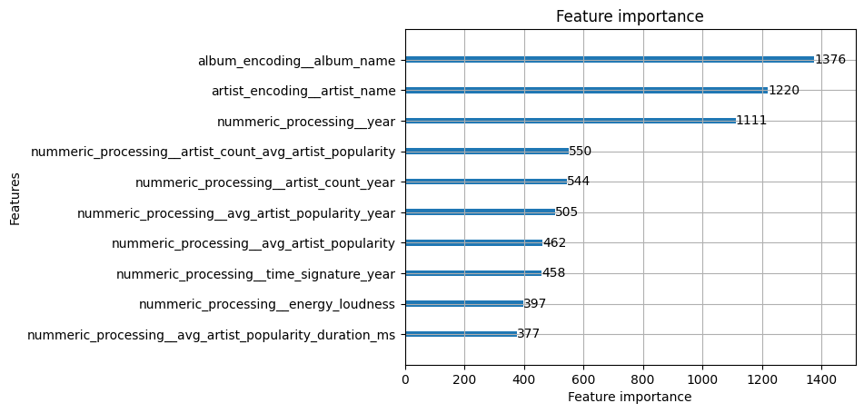

- This model has not proven to reliably predict the song's popularity any better than other models. In fact, it has performed worse.

### Classification

Since there was little success predicting the exact popularity, we decided to turn our analysis into a binary classification problem, where a song could either be popular, or unpopular. The line for a popular song has been arbitrarily chosen as "having `popularity` greater than or equal to `75`". However, the dataset was heavily imbalanced, even after removing `0` popularity entries, with only `301` popular songs compared to the `44313` unpopular ones.

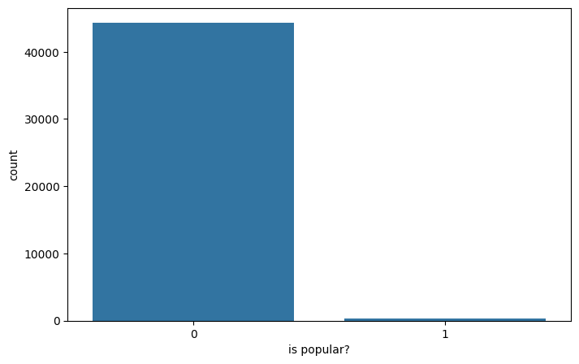

**1. Random Forest Classifier**

Unsurprisingly, the results of this one were terrible, due to imbalances in the set - achieving `0` recall rate with some false positives.

Random Forest ROC AUC Score: `0.7638086642599278`

F1 score: `0.0`

**2. Random Forest with SMOTE**

Here, we decided to address the imbalance by oversampling the popular songs using the SMOTE method. While getting some false positives, we also managed to get a few true positives. However, the recall rate was still only `0.07`.

Random Forest with SMOTE ROC AUC Score: `0.8574984957882069`

F1 score: `0.07407407407407407`

**3. LightGBM**

Next, we try using a gradient boosting method. We address the class imbalance using parameters of the classifier itself.Using this method we manage to achieve a recall rate of `0.80`. However, this also introduces around 36% false positives.

LightGBM ROC AUC Score: `0.7291629061371843`

F1 score: `0.028898254063816978`

**4. LightGBM with SMOTE**

Combining LightGBM with SMOTE yielded, so far, the best results. With a recall rate of `0.47` and only 4% of false positives, this has been the most successful model out of all tested.

LightGBM with SMOTE ROC AUC Score: `0.9050992779783393`

F1 score: `0.12121212121212122`

**5. XGBoost and XGBoost with SMOTE**

Results of both of these methods were similar to those of Random Forest with SMOTE. Interestingly, XGBoost performed better *without* the use of SMOTE.

XGBoost ROC AUC Score: `0.9167193140794223`

F1 score: `0.03225806451612903`

XGBoost with SMOTE ROC AUC Score: `0.8945848375451264`

F1 score (SMOTE): `0.0898876404494382`

**6. Hyperparemeter optimization**

To further improve our results, we try optimizing our best performing model (LightGBM with SMOTE).

Best parameters found:
- 'classification__subsample': 0.4
- 'classification__scale_pos_weight': 147.16236162361625
- 'classification__num_leaves': 127
- 'classification__n_estimators': 200
- 'classification__min_child_samples': 20
- 'classification__max_depth': 5
- 'classification__learning_rate': 0.1
- 'classification__colsample_bytree': 0.9000000000000001

Using these settings, we arrive at the following results:

Optimized LightGBM with SMOTE ROC AUC Score: `0.9125225631768953`

F1 score `0.11042944785276074`

As we can see, hyperparameter optimizing has resulted in worse scores than using the default settings.

### Key Findings

Key takeaway of the project is that we did not have enough data to reliably model popularity prediction, this lack of data is present both in attribute selection as well as proper
distribution of data in geographical and popularity terms. There are many songs which popularity is equal to 0, in addition the popularity average goes down with the year of release of the song
this might imply that older songs are more popular, however we must keep in mind that this could be due to bias because the counts on of the songs released before year 2000 are uncomparable in counts
to recent songs.

Another finding was that the data relationships and patterns are non-linear, as linear models failed miserably to explain the data - this is not a fault of overfitting as we had ~60 000 tracks and ~130 parameters. It should be noted that outlier impact analysis has not been performed on model level.

It is also important to state that optimization process was much more important in linear models than in ensemble methods. Optimizing ensemble (XGBoost) did improve the performance but not by a significant margin, however when it came to linear models the performance was more than doubled. This shows the importance of optimization in linear models. The change in performance could be attributed to cross validation as general linear regression does not have many hyperparameters to tune but the performance improvement was significant.

Instead, focusing on classifying whether a song is popular or not has yielded indecisive results. Even after addressing the poor class balance of the dataset, the models seemed to not differ much with the exception of LightGBM with oversampling. Even then, the model seemed to miss more than half popular songs.

## 5. Conclusions and Limitations

### Conclusions

#### 1. Is the data representative on a global scale and release year basis?

No, there is a bias towards more recent releases with the earliest release year being 1971, latest being 2024, but the median being 2017.

There is also a bias towards specific languages, as there are only 6 different languages, plus an unknown category, represented in the dataset with unequal distribution.

We can see a clear bias towards **South-East Asia** region, since the most prominent languages are of Indian and Korean origin, although English is present we must remember that English
is also used prevalently in India.

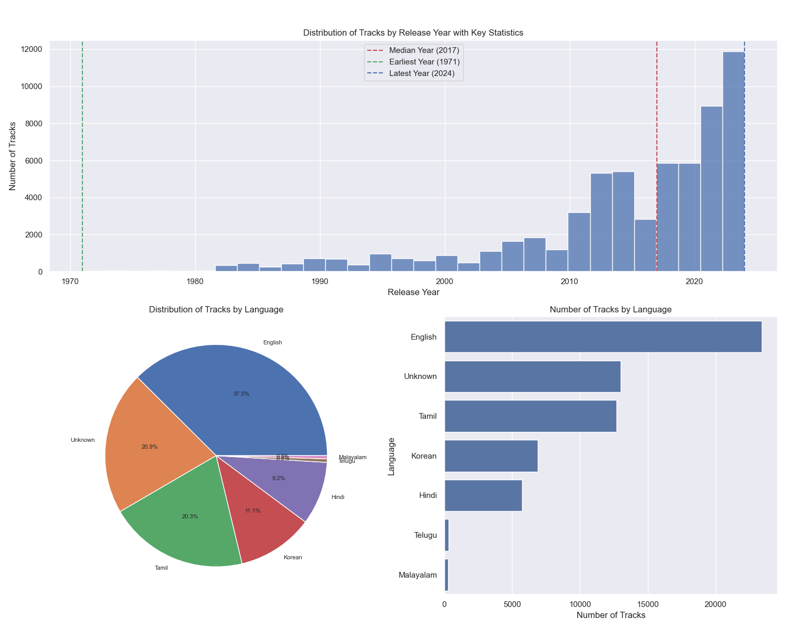

The popularity is also not very well represented in the dataset, with the median score being only 7 on a scale from 0 to 100. Over 28% of the data has a score of 0.

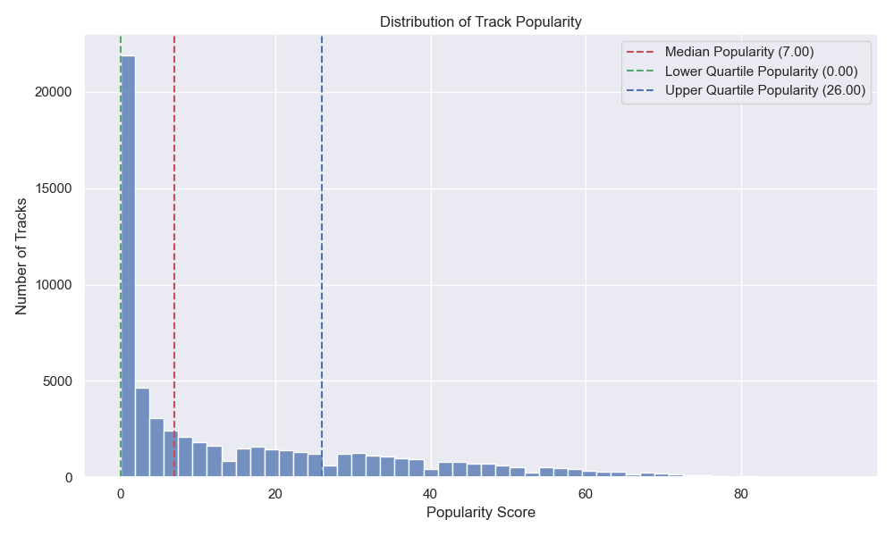

#### 2. Which musical attributes have the greatest impact on track popularity?

To answer this question we will analyse the attribute weights form the best estimator (optimized XGBoost regressor).

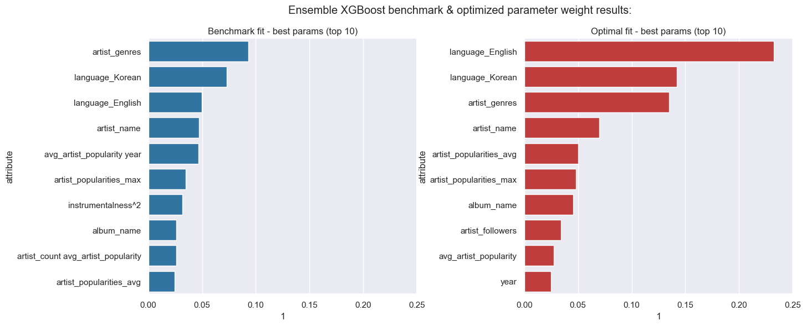

According to the best XGBoost model with test R^2 ~ 0.6, the most important parameters were English and Korean language as well as data regarding the artist - genre, artist popularity
and artist data aggregations, no acoustic data was present, this means (as expected) that the author of the track as well as marketing elements regarding the producer are far more important
elements than acoustic data.

#### 3. To what extent do acoustic vs artist attributes influence overall track popularity?

Music production is an industry where artist & producer fame are the key driving factors - artist fame is the key indicator of track's success as consumers mainly consume already existing and established producers, hence we can state that the data regarding artists, producers, related promotions and marketing activity (spending) is far more important than acoustic parameters of tracks,
the reason being is that we are predicting SENTIMENTAL value not a relationship anchored in physical laws and natural processes.

### Limitations

#### Data limitations

- Having to use a downloaded dataset instead of a scraped one limited our ability to collect less biased data and create a more representative dataset. It also narrowed our research options and sample size.
- The downloaded dataset also contained missing values, which could have been avoided if we had used a scraper.
- The distribution of popularity within the dataset seems to heavily skew towards unpopular songs.

#### Model limitations

- The Random Forest model was having running issues, so it had to be abandoned during the last steps, which left us with only one ensemble model.
